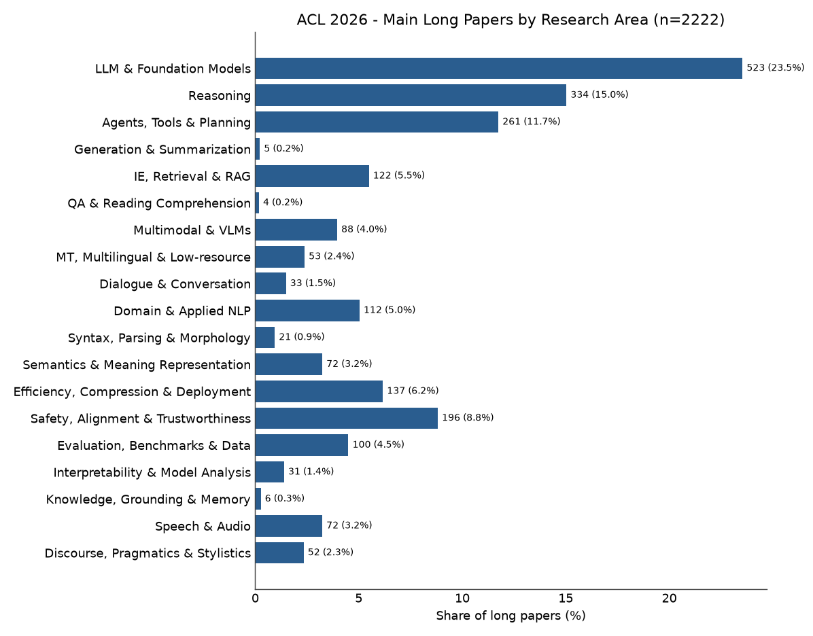
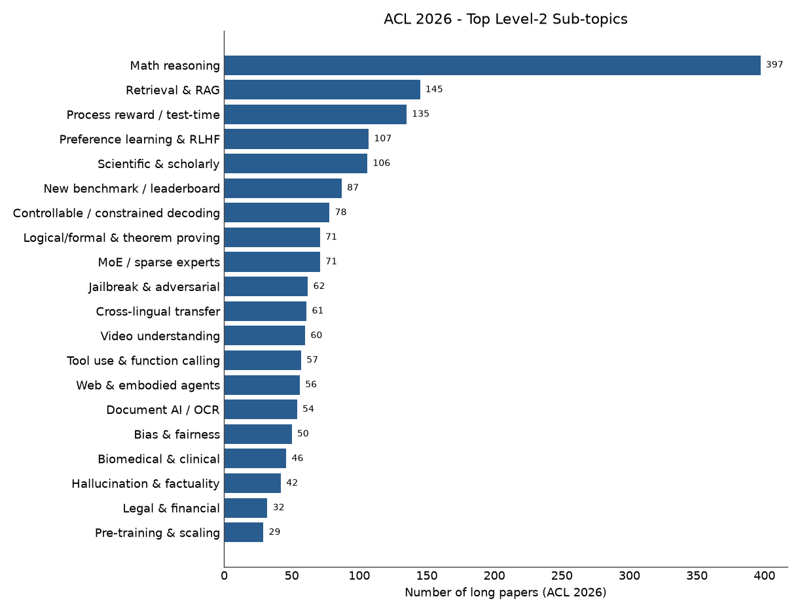
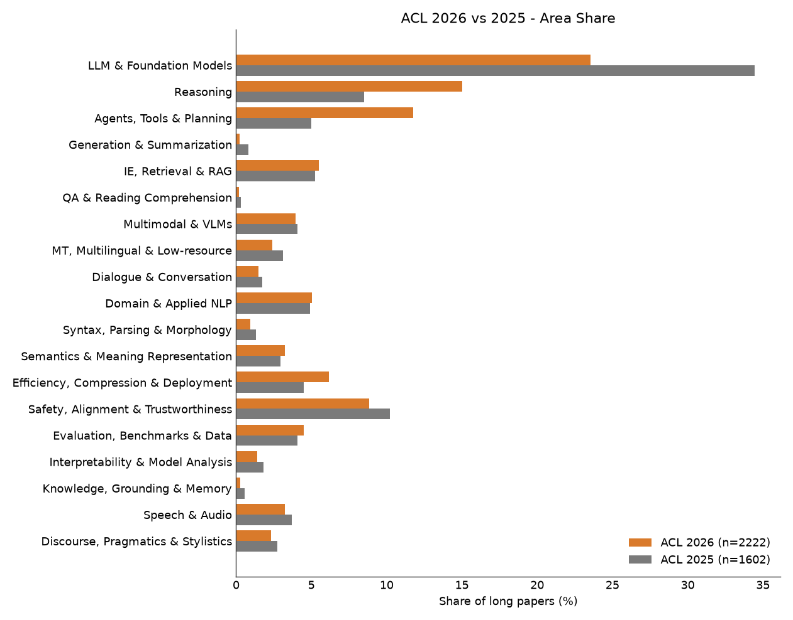
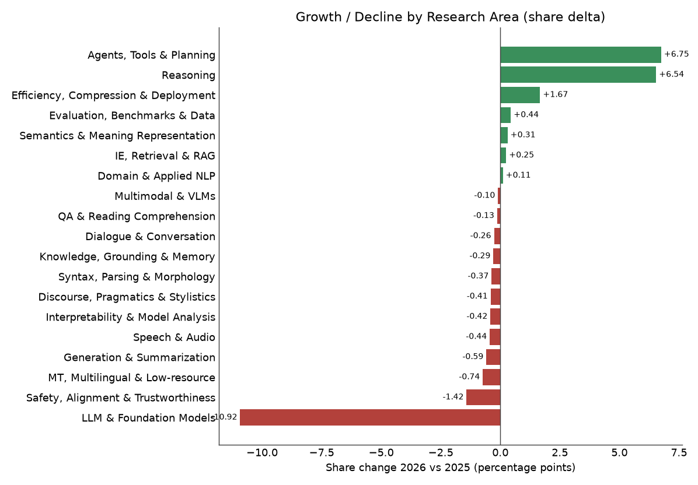
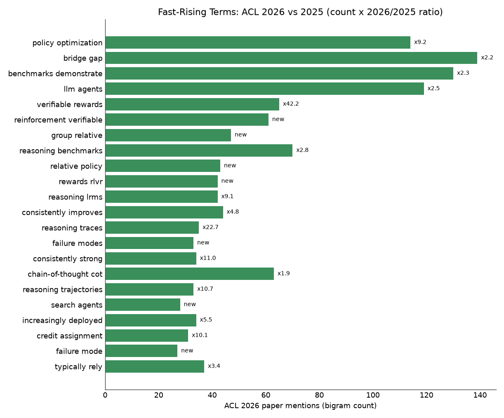

# ACL 2026 主会长文研究方向调研：2222 篇论文全量分类与新增领域分析

> **数据来源**：ACL Anthology 官方元数据（GitHub `acl-org/acl-anthology`，master 分支；2026 数据 ingest-date 2026-06-22）。范围**仅主会长文（Main Conference Long Papers）**——短文、Findings、Industry、Demo、SRW、Tutorials、工作坊均不计入。对象：**ACL 2026 主会长文 2222 篇**（第 64 届，San Diego），对比 **ACL 2025 主会长文 1602 篇**（第 63 届）。方法：固定两级分类体系（19 个大方向 + ~45 子主题）+ 关键词签名与 TF-IDF 质心混合打分，确定式离线计算。

## 一、概述

ACL 2026 主会长文规模为 **2222 篇**，较 ACL 2025 的 **1602 篇** 增长 **+38.6%（+620 篇）**。在论文总量大幅扩张的背景下，研究方向的结构发生了显著重塑：传统"大模型基础研究"的份额被严重稀释，而**推理（Reasoning）与智能体（Agents）**两大方向以最快速度崛起，成为 2026 主会的双主线。与之同步浮现的是一组全新的技术词汇——以 **GRPO（Group Relative Policy Optimization）** 和 **RLVR（Reinforcement Learning with Verifiable Rewards）** 为代表的"用可验证奖励做强化学习来训练推理"范式，在 2025 几乎为零，2026 已遍布摘要。

本报告基于标题+摘要对全部 3824 篇长文逐篇自动打标，并按两级体系统计对比。需注意：分类为确定式近似（多主题论文取主标签），随机抽检 50 篇主标签约 **85% 合理**，趋势性结论对个别误标稳健（详见第六节局限）。

## 二、方法

1. **数据解析**：从 `2026.acl.xml` / `2025.acl.xml` 的 `volume[id=long]` 提取每篇论文的标题、摘要、作者、anthology id。经核验，两年长文卷均为正式"Volume 1: Long Papers"主会论文，URL 前缀分别为 `2026.acl-long` / `2025.acl-long`，与独立归档的 Findings（2026 共 2163 篇）无重叠，口径一致可比。
2. **两级分类体系**：Level-1 共 19 个大方向（见附录 A）；Level-2 约 45 个子主题（附录 B）。每个类目配关键词短语签名。
3. **打分**：对每篇论文，混合得分 = 0.55 × 关键词命中归一分 + 0.45 × 与各类目 TF-IDF 质心的余弦相似度（质心由关键词高分种子论文自举得到）。取最高分类目为主标签。
4. **新兴领域扫描**：对两年标题+摘要做 1–2 gram 词频，剔除通用词后，按"2026 相对频次 / 2025 相对频次"比值与绝对增量排序，浮现体系外新术语。

## 三、ACL 2026 全景

2026 主会长文 19 个大方向的分布（按占比）：

| 排名 | 研究方向 | 篇数 | 占比 |
|---|---|---|---|
| 1 | LLM 与基础模型 | 523 | 23.5% |
| 2 | 推理 | 334 | 15.0% |
| 3 | 智能体、工具与规划 | 261 | 11.7% |
| 4 | 安全、对齐与可信 | 196 | 8.8% |
| 5 | 效率、压缩与端侧部署 | 137 | 6.2% |
| 6 | 信息抽取、检索与 RAG | 122 | 5.5% |
| 7 | 领域与应用 NLP | 112 | 5.0% |
| 8 | 评测、基准与数据 | 100 | 4.5% |
| 9 | 多模态与多模态大模型 | 88 | 4.0% |
| 10 | 语义、常识知识与意义表示 | 72 | 3.2% |
| 11 | 语音与音频 | 72 | 3.2% |
| 12 | 机器翻译与多语言/低资源 | 53 | 2.4% |
| 13 | 篇章、语用与文体 | 52 | 2.3% |
| 14 | 对话与会话系统 | 33 | 1.5% |
| 15 | 可解释性、模型分析与探针 | 31 | 1.4% |
| 16 | 句法、词法与解析 | 21 | 0.9% |

（知识/接地/记忆、生成与摘要、问答与阅读理解占比均 <0.5%，见对比表。）

**结构性特征**：仅"LLM 与基础模型 + 推理 + 智能体"三者就占去 2026 主会的 **50.2%**。若加上安全对齐与效率部署，前五大方向合计 **65.2%**。这与 ACL 2025"LLM 一家独大"的形态明显不同——2026 是"LLM 之上长出推理与智能体"的格局。

子主题层面，2026 体量最大的包括：**数学推理、工具使用与函数调用、多智能体、过程奖励/测试时计算、幻觉与事实性、越狱与对抗、MoE 稀疏专家、视频理解、定理证明**等。
## 四、ACL 2026 vs 2025 对比

两年大方向完整对比（按 2026 篇数降序，pp = 百分点）：

| 研究方向 | 2026 | 2025 | 篇数增量 | 占比变化 |
|---|---|---|---|---|
| LLM 与基础模型 | 523 | 552 | -29 | **-10.9 pp** |
| 推理 | 334 | 136 | +198 | **+6.5 pp** |
| 智能体、工具与规划 | 261 | 80 | +181 | **+6.8 pp** |
| 安全、对齐与可信 | 196 | 164 | +32 | -1.4 pp |
| 效率、压缩与端侧部署 | 137 | 72 | +65 | +1.7 pp |
| 信息抽取、检索与 RAG | 122 | 84 | +38 | +0.3 pp |
| 领域与应用 NLP | 112 | 79 | +33 | +0.1 pp |
| 评测、基准与数据 | 100 | 65 | +35 | +0.4 pp |
| 多模态与多模态大模型 | 88 | 65 | +23 | -0.1 pp |
| 语义、常识知识与意义表示 | 72 | 47 | +25 | +0.3 pp |
| 语音与音频 | 72 | 59 | +13 | -0.4 pp |
| 机器翻译与多语言/低资源 | 53 | 50 | +3 | -0.7 pp |
| 篇章、语用与文体 | 52 | 44 | +8 | -0.4 pp |
| 对话与会话系统 | 33 | 28 | +5 | -0.3 pp |
| 可解释性、模型分析与探针 | 31 | 29 | +2 | -0.4 pp |
| 句法、词法与解析 | 21 | 21 | 0 | -0.4 pp |
| 知识、接地与记忆 | 6 | 9 | -3 | -0.3 pp |
| 生成与摘要 | 5 | 13 | -8 | -0.6 pp |
| 问答与阅读理解 | 4 | 5 | -1 | -0.1 pp |

**两个关键解读**：

1. **"LLM 与基础模型"份额大跌（-10.9 pp）并非衰退，而是稀释与转移。** 该方向绝对篇数仅微降（552→523），但因为总盘子扩张 38.6%，其占比从 34.5% 跌到 23.5%。更准确地说，大量原本归入"LLM 基础研究"的工作，在 2026 被更具体地定位为推理或智能体——LLM 正从"研究对象"变为承载推理与智能体的"底座"。

2. **几乎全部传统 NLP 方向份额持平或微降**（MT -0.7、句法 -0.4、对话 -0.3、语音 -0.4、多模态 -0.1）。绝对篇数多数仍在增长（语音 +13、多模态 +23、语义 +25），只是增速跑输大盘。真正的份额赢家只有四个：**推理、智能体、效率部署、检索/RAG**。

**子主题（Level-2）变化最显著者**：

- 增长 Top：数学推理 +8.1 pp（156→397）、过程奖励/测试时计算 +4.5 pp（26→135）、Web/具身智能体 +1.0 pp、逻辑/形式推理与定理证明 +1.0 pp、工具使用 +0.9 pp、视频理解 +0.8 pp、MoE 稀疏专家 +0.8 pp、越狱与对抗 +0.3 pp。
- 下滑 Top（份额）：科研文献 NLP -3.6 pp、指令微调与 RLHF -1.4 pp、跨语言迁移 -1.4 pp、标注与数据质量 -1.2 pp。
- "指令微调与 RLHF"子主题份额下降值得注意：RLHF 作为通用对齐框架热度未减（见安全对齐方向 +32 篇），但单独以"指令微调/RLHF"为主命题的论文在减少，力量转移到了更具体的 **GRPO/RLVR 推理训练范式**（见第五节）。

## 五、新增与崛起的研究领域

### 5.1 体系内：两大新增主线

**（A）推理（Reasoning）** —— 本届最强增长引擎。从 8.5% 跃升至 15.0%（+6.5 pp，绝对 +198 篇），其中"数学推理"几乎翻倍以上（156→397），"过程奖励/测试时计算"从边缘走向主流（26→135）。这反映了 OpenAI o1、DeepSeek-R1 等推理模型所开启的"测试时计算/过程级奖励"范式在 2026 全面落地。

**（B）智能体（Agents, Tools & Planning）** —— 增幅最大的方向（占比 +6.8 pp，绝对 +181 篇，从 80 翻到 261）。工具使用与函数调用、多智能体、Web/代码/具身智能体、规划与反思等子线全面铺开。这是 2026 与 2025 最直观的差异：智能体从"小众探索"变为"主会一级主线"。

### 5.2 体系外：浮现的新技术词汇

n-gram 增量扫描（2026 相对 2025）中最突出的术语：

- **GRPO（Group Relative Policy Optimization）**：相关片段 `group relative`、`relative policy`、`policy optimization`（x9.2）、`optimization grpo` 在 2025 几乎为零，2026 高频出现。
- **RLVR（Reinforcement Learning with Verifiable Rewards）**：`verifiable rewards`、`rewards rlvr` 为全新词，2025 无对应。
- **推理模型 / LRM**：`reasoning traces`、`reasoning trajectories`、`reasoning benchmarks`（x2.8）、`reasoning lrms` 均为新晋高频。
- **智能体相关**：`llm agents`（x2.5）、`search agents`、`credit assignment`（x10.1，指多步智能体中的信用分配）。
- 单词层面：`reinforcement`（x3.6）、`agentic`（x3.9）、`policy`（x3.0）、`execution`（x3.7）、`rewards`（x2.7）、`supervision`（x3.2）、`memory`（x2.0）。

**一句话概括新增领域**：2026 的"新"高度集中在 **"用可验证奖励的强化学习（RLVR/GRPO）训练推理模型，并把这些推理能力封装进能调用工具、长程规划的智能体"** 这条技术主线。它同时解释了推理、智能体、效率（推理模型推理成本高→催生压缩/加速）三个方向的同步崛起，也解释了"测试时计算/过程奖励"子主题的爆发。

### 5.3 值得关注的次级趋势

- **效率与部署持续升温（+1.7 pp，+65 篇）**：推理模型与长上下文带来高昂推理成本，量化、推测解码、KV-cache 优化、MoE 等需求上升。
- **定理证明/形式化推理（+1.0 pp）**：Lean 4 等形式化数学与 LLM 结合成为推理方向的新分支。
- **视频理解（+0.8 pp）**：多模态内部结构从"图文"向"视频/时序"迁移。
- **MoE 稀疏专家（+0.8 pp）**：基础模型侧从稠密走向稀疏架构。

## 六、观察与局限

**趋势判断**：

1. ACL 2026 标志着 NLP 研究重心从"训练更好的语言模型"转向"用语言模型做推理与行动"。LLM 成为基础设施，增量价值上移到推理与智能体层。
2. 一条清晰的技术叙事贯穿多个方向：**RLVR/GRPO → 推理模型 → 智能体 → 推理成本 → 效率部署**。把握这条链有助于理解 2026 的整体格局。
3. 传统强项（MT、句法、对话、问答）作为独立方向的份额继续收缩，但绝对量多数仍增长，更多是被"LLM 底座"吸收（如问答 largely 并入 LLM/RAG 主标签），而非真正消失。

**局限**：

- 分类基于标题+摘要的确定式近似，多主题论文取主标签，随机抽检 50 篇主标签约 85% 合理，存在约 2% 明显误标（如个别 OCR/HTR 论文落入可解释性）。趋势结论对个别误标稳健。
- "问答与阅读理解""知识/接地/记忆""生成与摘要"三个方向召回偏低（部分真实论文被 LLM/RAG 主标签吸收），其绝对数应视为下界。
- 一级分类体系为自定义 19 类，非 ACL 官方主题划分；不同体系会导致数值差异，但相对趋势稳定。
- "新增领域"判定依赖关键词与词频增量，对命名变化敏感（同一技术换名可能被记为新词）。

**可复现性**：基于公开的 `acl-org/acl-anthology` 仓库即可完整复现——读取各年 `data/xml/<year>.acl.xml` 的 `volume[id=long]`，按上述两级体系与混合打分重新分类。

---

## 附录 A：Level-1 大方向清单（19）

LLM 与基础模型 · 推理 · 智能体/工具/规划 · 生成与摘要 · 信息抽取/检索/RAG · 问答与阅读理解 · 多模态与多模态大模型 · 机器翻译/多语言/低资源 · 对话与会话系统 · 领域与应用 NLP · 句法/词法/解析 · 语义/常识/意义表示 · 效率/压缩/部署 · 安全/对齐/可信 · 评测/基准/数据 · 可解释性/模型分析 · 知识/接地/记忆 · 语音与音频 · 篇章/语用/文体。

## 附录 B：Level-2 子主题清单（节选）

- LLM 与基础模型：预训练与缩放 · 长上下文 · 适配与 PEFT · MoE/稀疏专家 · 指令微调与 RLHF
- 推理：数学推理 · 逻辑/形式/定理证明 · 常识推理 · 思维链与搜索 · 过程奖励/测试时
- 智能体/工具/规划：工具使用与函数调用 · 多智能体 · Web/具身智能体 · 规划与反思 · 代码智能体
- 信息抽取/检索/RAG：实体/关系/事件 · 检索与 RAG · 知识图谱构建 · 共指
- 多模态：视觉语言模型(VLM) · 图像描述 · 视频理解 · 文档AI/OCR · 视觉推理/接地
- 安全/对齐/可信：越狱与对抗 · 偏见与公平 · 幻觉与事实性 · 偏好学习与 RLHF · 毒性与内容审核 · 隐私与水印

完整两级标签见 `data/acl2026_long_labeled.csv`、`data/acl2025_long_labeled.csv`；两年逐类计数见 `data/summary_by_area.csv`。

